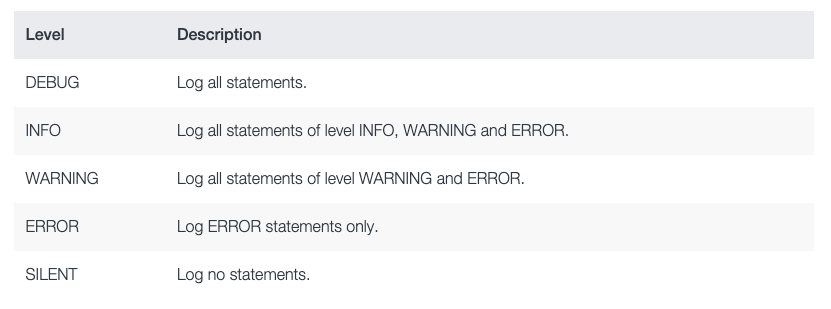

<p align="center">
  
  
</p>

<h1 align="center">Hyperswitch Unified Checkout</h1>

<div align="center" >
<i>Accept payments from around the globe with a secure, Unified Checkout that gives your customers the best in class payment experience</i>
<br/><br/>
Web unified checkout SDK is an inclusive, consistent and blended payment experience optimized for the best conversion rates.
<br/><br/>
<strong>Inclusive</strong>: A variety of global payment methods including cards, buy now pay later and digital wallets are supported by the Unified Checkout, with adaptation to local preferences and ability to local language customization.

<strong>Consistent</strong>: With a diverse set of payment methods supported, the Unified Checkout provides a singular consistent payment experience across platforms (web, android and ios) powered by smart payment forms, minimal redirections and intelligent retries.

<strong>Blended</strong>: The Unified Checkout includes 40+ styling APIs, which could be tweaked to make the payment experience blend with your product. Your users will get a fully native and embedded payment experience within your app or website

</div>

<p align="center">
  <a href="#%EF%B8%8F-quick-start-guide">Quick Start Guide</a> •
  <a href="#%EF%B8%8F-try-it-in-local">Local Setup Instructions</a> •
  <a href="#-backend-server">Backend Server</a> •
  <a href="#-faqs">FAQs</a>
  <br>
  <a href="#-join-us-in-building-hyperswitch">Join us in building HyperSwitch</a> •
  <a href="#community">Community</a> •
  <a href="#bugs-and-feature-requests">Bugs and feature requests</a> •
  <a href="#-copyright-and-license">Copyright and License</a>
</p>

<p align="center">
  <a href="https://github.com/juspay/hyperswitch-web/blob/main/LICENSE">
    
  </a>
  <a href="https://github.com/juspay/hyperswitch-web/blob/main/LICENSE">
    
  </a>
</p>


While the Unified Checkout is pre-optimized for maximum conversions, it does not restrict you to stick to a one-size-fits-all approach. Using the SDK APIs, you get complete control over modifying the payment experience by,

- 📝 **Including new fields to the payment form** on a single processor like Stripe or Braintree
- 💳 **Prioritizing payment methods** by 90% to add & maintain integrations
- 🎨 **Switching themes and layouts of checkout page** with full visibility and control

## ⚡️ Quick Start Guide

Ways to get started with Hyperswitch:

### Try it in our Sandbox Environment: Fast and easy to start.

&nbsp; &nbsp; To integrate Hyperswitch into your project, follow these steps:

1.  **Register**: Begin by registering at [Hyperswitch](https://app.hyperswitch.io/register) to gain access to your dashboard.

1.  **Access Your Dashboard**: Once logged in, navigate to your dashboard's home page.

1.  **Find Your Keys**: In the sidebar, you can find your [API Keys](https://app.hyperswitch.io/developer-api-keys). Here, you can also generate your API Key. Additionally, your Publishable Key is available within the same section.

1.  **Integration**: After obtaining your Keys add them to your project's environment variables or configuration file for seamless integration.

### 🛠️ Try it in Local

&nbsp; &nbsp; You will need to understand and configure a few configurations before starting the local setup. -

- #### Env Configs for Demo App

  - **`HYPERSWITCH_PUBLISHABLE_KEY`:** The publishable key of your Hyperswitch account. This key will start with `pk_dev_` for local development, `pk_snd_` for sandbox, and `pk_prd_` for production.

  - **`HYPERSWITCH_SECRET_KEY`:** The API key of your Hyperswitch account that is used to authenticate API requests from your merchant server.

  - **`HYPERSWITCH_SERVER_URL`:** The URL of the Hyperswitch backend server. You may use our Sandbox URL (https://sandbox.hyperswitch.io). To do this, go to the Hyperswitch Dashboard, find the "Developers" section, then click on [API Keys](https://app.hyperswitch.io/dashboard/developer-api-keys). Here you can generate an API key (`HYPERSWITCH_SECRET_KEY`) and copy your publishable key (`HYPERSWITCH_PUBLISHABLE_KEY`).<br>
    Alternatively, you can specify that your backend is running locally (e.g. http://localhost:8080). In this case, you will need to create the API key and publishable key locally. Read this [hyperswitch docs](https://github.com/juspay/hyperswitch/blob/main/docs/try_local_system.md) on how to do this.

  - **`HYPERSWITCH_CLIENT_URL`:** The URL of your hosted Hyperswitch SDK (e.g. http://localhost:9050). You may also use our Sandbox URL (https://beta.hyperswitch.io/v1).

  - **`SELF_SERVER_URL`:** The URL of the hosted server file for generating client-secret and for fetching urls & configs (eg: http://localhost:5252).

- #### Env Configs for SDK

  - **`ENV_BACKEND_URL`:** Sets the endpoint for all the APIs used within the SDK to interact with the backend service. If you are running your own backend service, you can configure and specify its endpoint here for local setups.

  - **`ENV_LOGGING_URL`:** Specifies a custom logging endpoint where logs generated by the SDK can be sent. This allows you to view and manage logs according to your requirements.

  ### Setup Node

  Check if your machine has node already installed by running the below command on your local machine.

  ```bash
  node -v
  ```

  If your machine does not have node installed in it, you can install it from [here](https://nodejs.org/en/download)

    <h3>Clone the repo</h3>

  Clone the repository from Bitbucket and save in your folder.

  ```bash
  git clone https://github.com/juspay/hyperswitch-web.git
  cd hyperswitch-web
  ```

  ### Setup the repo

  1. First install all the node modules by running the following command.

     ```bash
     npm install
     ```

  2. Once the installation is successful, you can open two terminals.<br>

     - On the first terminal run the following command for generating the build:

       ```bash
       npm run re:start
       ```

     - On the second terminal, run the following command for starting the SDK server (by default on http://localhost:9050).

       ```bash
         npm run start
       ```

     Upon success, you should see a message _Compiled successfully_ message on both of your terminals.

  3. Now that the build is generated successfully, on a third terminal, launch the playground.

     ```bash
     cd Hyperswitch-React-Demo-App
     npm install
     npm run start
     ```

     Now you can launch the demo app on http://localhost:5252/ where you can test your payments.<br>
     If you encounter any problems, please refer to the troubleshooting section of the [Hyperswitch-React-Demo-App Readme](./Hyperswitch-React-Demo-App/README.md#troubleshooting).

  > 💡 Alternatively, you can update `.env` file and use the commands
  > above

## ⛁ Backend Server

There are two ways to set up the backend:

- ### Local Setup

  - Install in your local system: Configurations and setup required in your system. Suitable if you like to customise the core offering, [learn more](https://github.com/juspay/hyperswitch/blob/main/docs/try_local_system.md)

  - If you are running our backend locally, you can use our [Postman Collection](https://github.com/juspay/hyperswitch/blob/main/docs/try_local_system.md#try-out-our-apis) for generating the API Key and Publishable Key.

- ### Custom Backend

  For configuring `customBackendUrl`, when calling Hyper function you can pass the customBackendUrl in props

  In Payment.js file -

  ```javascript
  window.Hyper(publishableKey, {
    customBackendUrl: `CUSTOM_BACKEND_URL`,
  });
  ```

  **Warning:** Please maintain API compatibility of your server and web app. If any API contracts are manually changed without the corresponding handling in the SDK, there is a possibility of the application not working as expected. Please ensure that you use the compatible versions. The latest [releases](https://github.com/juspay/hyperswitch/releases) will have the additional details of the compatible versions of the app server, web app, and the control center.

## 📊 Custom Logging

Logging from the payment checkout web client is crucial for tracking and monitoring the flow of payments. It provides a transparent record of events, errors, and user interactions, aiding developers and support teams in identifying issues, debugging, and ensuring the security and reliability of payment processes. Well-implemented logging enhances traceability and facilitates a more efficient resolution of potential problems in the payment checkout experience.

Logs are sent to the server via non-blocking Beacon API requests. This means that even if the logging endpoint configured is incorrect, it would not affect the core payment functionalities. You can find more about the structure of logging request payload in the `beaconApiCall` function in the [`OrcaLogger.res`](./src/orca-log-catcher/OrcaLogger.res#L423C7-L423C20) file.

If you want to collect logs, you can do so by setting up an endpoint on your server to receive, process and persist logs.

In the [`webpack.common.js`](./webpack.common.js) file, you would have to enable the logging flag, and configure the logging endpoint and log level.

```javascipt
let logEndpoint =
  sdkEnv === "prod"
    ? "<YOUR_PRODUCTION_LOGGING_ENDPOINT>"
    : "<YOUR_SANDBOX_LOGGING_ENDPOINT>";

// Set this to true to enable logging
let ENABLE_LOGGING = true;

// Choose from DEBUG, INFO, WARNING, ERROR, SILENT
let loggingLevel = "DEBUG";
```

<br>
<div style="display: flex; align-items: center; flex-direction: column;">
  
  <i>Understanding Logging Levels</i>
</div>
<br>

Now let's test the integration by making a payment from your web client!

## 🔌 Integrate Hyperswitch on your App

Now that the project is up and running, integrating Hyperswitch on your web-app is fast &
easy.

Follow the instructions detailed on our
[documentation page][hyperswitch-docs].

[dashboard]: https://app.hyperswitch.io/register
[hyperswitch-docs]: https://hyperswitch.io/docs/sdkIntegrations/unifiedCheckoutWeb/

## 🤔 FAQs

Got more questions?
Please refer to our [FAQs page][faqs].

[faqs]: https://hyperswitch.io/docs/devSupport

### External Services

- Braintree
- Trustpay
- Sentry
- ApplePay
- GooglePay
- Klarna

### Security Documentation

For security compliance, we maintain an inventory of all third-party scripts used in this project with justifications for their necessity. You can view this documentation in our [Script Inventory](./docs/SCRIPT_INVENTORY.md) file.

## 💪 Join us in building Hyperswitch

### 🤝 Our Belief

> Payments should be open, fast, reliable and affordable to serve
> the billions of people at scale.

Globally payment diversity has been growing at a rapid pace.
There are hundreds of payment processors and new payment methods like BNPL,
RTP etc.
Businesses need to embrace this diversity to increase conversion, reduce cost
and improve control.
But integrating and maintaining multiple processors needs a lot of dev effort.
Why should devs across companies repeat the same work?
Why can't it be unified and reused? Hence, Hyperswitch was born to create that
reusable core and let companies build and customise it as per their specific requirements.

### ✨ Our Values

1. Embrace Payments Diversity: It will drive innovation in the ecosystem in
   multiple ways.
2. Make it Open Source: Increases trust; Improves the quality and reusability of
   software.
3. Be community driven: It enables participatory design and development.
4. Build it like Systems Software: This sets a high bar for Reliability,
   Security and Performance SLAs.
5. Maximise Value Creation: For developers, customers & partners.

### 🤍 Contributing

This project is being created and maintained by [Juspay](https://juspay.in),
South Asia's largest payments orchestrator/switch, processing more than 50
Million transactions per day. The solution has 1Mn+ lines of Haskell code built
over ten years.
Hyperswitch Web leverages our experience in building large-scale, enterprise-grade &
frictionless payment solutions.
It is built afresh for the global markets as an open-source product in Rescript.
We are long-term committed to building and making it useful for the community.

The product roadmap is open for the community's feedback.
We shall evolve a prioritisation process that is open and community-driven.
We welcome contributions from the community.

## Community

Get updates on Hyperswitch development and chat with the community:

- Read and subscribe to [the official Hyperswitch blog][blog].
- Join our [Discord server][discord].
- Join our [Slack workspace][slack].

[blog]: https://hyperswitch.io/blog
[discord]: https://discord.gg/wJZ7DVW8mm
[slack]: https://join.slack.com/t/hyperswitch-io/shared_invite/zt-2awm23agh-p_G5xNpziv6yAiedTkkqLg
[github-discussions]: https://github.com/juspay/hyperswitch-web/discussions

<div style="display: flex;  justify-content: center;">
    <div style="margin-right:10px">
    <a href="https://www.producthunt.com/posts/hyperswitch-2?utm_source=badge-top-post-badge&utm_medium=badge&utm_souce=badge-hyperswitch&#0045;2">
        
    </a>
    </div>
    <div style="margin-right:10px">
    <a href="https://www.producthunt.com/posts/hyperswitch-2?utm_source=badge-top-post-topic-badge&utm_medium=badge&utm_souce=badge-hyperswitch&#0045;2">
        
    </a>
  </div>
  <div style="margin-right:10px">
    <a href="https://www.producthunt.com/posts/hyperswitch-2?utm_source=badge-top-post-topic-badge&utm_medium=badge&utm_souce=badge-hyperswitch&#0045;2">
        
    </a>
  </div>
</div>

## Bugs and feature requests

Please read the issue guidelines and search for [existing and closed issues].
If your problem or idea is not addressed yet, please [open a new issue].

[existing and closed issues]: https://github.com/juspay/hyperswitch-web/issues
[open a new issue]: https://github.com/juspay/hyperswitch-web/issues/new/choose

## © Copyright and License

This product is licensed under the [Apache 2.0 License](LICENSE).

## Thanks to all contributors

Thank you for your support in hyperswitch's growth. Keep up the great work! 🥂

<a href="https://github.com/juspay/hyperswitch-web/graphs/contributors">
  
</a>

